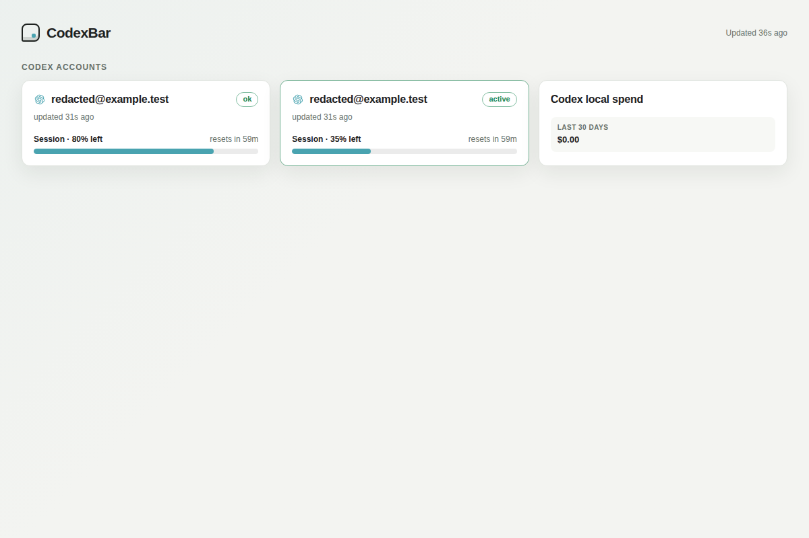
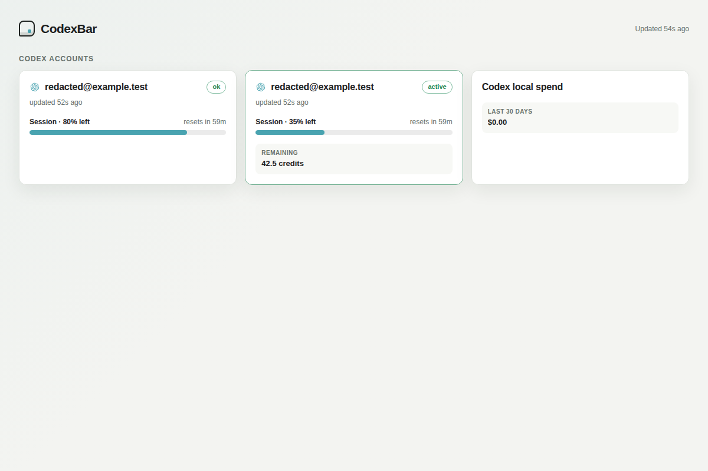

# PR 3832 runtime and visual evidence

Source: `0601278c0bce1a31800e0d45120865f0926a6f5e`.
Before renderer: `6dad914fca02465d160a47e327ba2a901c1c6ba4`.

The actual compiled `CodexBarCLI` read two isolated Codex profile homes and fetched usage from a loopback-only mock provider using the supported `chatgpt_base_url` setting. All credentials and account identities were synthetic fixtures; no real provider account, browser cookies, or Keychain was used. These are executable integration results, not live-provider verification.

- `dashboard-normal.json`: actual `dashboard --all-accounts --identity redacted --timeout 5` output. Both profiles appear, the second is active, usage is 20%/65%, and selected-account credits are 42.5.
- `serve-normal.json`: actual authenticated `/dashboard/v1/snapshot` response from `serve --all-accounts --identity redacted`.
- `dashboard-timeout.json` and `serve-timeout.json`: the second fixture's response was delayed beyond a two-second command/request budget. Both transports retained the completed first profile and emitted an account-local timeout for the active second profile. No private account label or internal cache key appeared in the output.
- Screenshots render the production dashboard HTML with the captured server response, 1200x800, light theme. Before: selected credits hidden. After: credits visible exactly once, on the selected account. The same renderer was also checked at 390px in dark mode, including a zero credit balance, with no horizontal overflow or card overlap.

## Before

## After

The workflow in this branch checks out the exact source commit above. Its workflow commit is distinct from the source under test. This independent fork verification neither approves nor replaces upstream CI.
